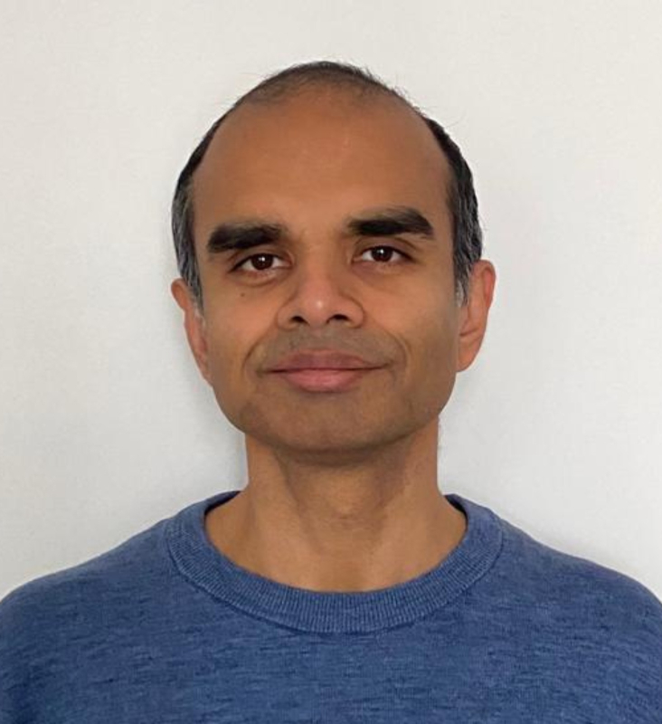

## Welcome to my website!

I am an experienced software engineer, who can contribute to performance oriented application and system development.

Project areas:\
Numerical software, desktop and mobile apps, back-end/server-side development, embedded software, database internals and other systems software, AI infrastructure and inference.

Main skill set:\
C, C++, code optimization, parallel and concurrent programming.\
Data Science/AI/ML. Geometric and Visual Computing.\
Linux, GDB, CMake, Git, GoogleTest.\
Design patterns, TDD.\
OpenMP, CUDA.\
Python, SQL.

Comfortable with:\
Go, Java, Rust. PyTorch.\
x86 Assembly. LLVM.\
Web back-end technologies.

Enthusiastic about algorithms and data structures.

Always curious about new languages, paradigms, frameworks and tools.

Enjoy teaching, mentoring and collaboration.

Experience in both production and research environments.

French: B2 (Intermédiare).
